# NYAYA RAKSHAK: Complete PostgreSQL Data Model Specification
### AI Legal Clarity, Verification & Action Navigator

---

## 1. Executive Summary & Design Principles

The **NYAYA RAKSHAK** relational database model is engineered to provide an India-first, citizen-centric legal clarity platform supporting complex document parsing, clause intelligence, statutory grounding, claim verification, risk evaluation, and legal aid discovery.

```
       AI EXPLAINS.
    EVIDENCE SUPPORTS.
   VERIFICATION CHECKS.
     RULES CALCULATE.
      HUMANS DECIDE.
```

### Architectural Guardrails:
1. **Strong Primary Keys**: Every table utilizes an autoincrement `Integer` (or `BigInteger` for high-throughput audit tables) for high-performance internal joins and B-Tree indexing, combined with an indexed immutable UUIDv4 (`uuid`) string for all API representations and client-facing endpoints to eliminate integer enumeration attacks.
2. **Anti-IDOR / Anti-BOLA Boundaries**: User-owned objects enforce hard ownership foreign keys (`user_id`) and optional tenancy boundaries (`organization_id`). Queries require both object identity and owner verification (`WHERE id = :id AND user_id = :current_user_id`).
3. **Strict Check & Domain Constraints**: Business rules are enforced at the database storage engine layer (e.g., valid document lifecycle states, legal source authority levels, confidence scores bounded within `[0.0, 1.0]`, non-negative page numbers, distinct comparison documents).
4. **Referential Integrity & Cascading**: Foreign keys explicitly specify `ON DELETE CASCADE` for parent-child hierarchies (e.g. documents $\rightarrow$ pages, clauses, risks) or `ON DELETE SET NULL` for auditability and compliance trails (e.g. audit logs, security events).
5. **Soft-Delete with Historical Auditing**: Documents support soft-deletion via `deleted_at` timestamp and status `'DELETED'`. Active queries filter on `deleted_at IS NULL`, while compliance and legal dispute audits retain full access to historical evidence.
6. **Vector Search Ready (`pgvector`)**: Cross-dialect `SafeVector(768)` type decorator executes native `pgvector.sqlalchemy.Vector(768)` in PostgreSQL while seamlessly falling back to JSON serialization for local developer workstations and in-memory test suites without requiring external infrastructure.
7. **Absolute Prohibition of Fabricated Legal Authorities**: Legal sources in the database are strictly restricted to authentic Indian Gazette legislation (e.g., Bharatiya Nyaya Sanhita 2023, Bharatiya Nagarik Suraksha Sanhita 2023, Consumer Protection Act 2019, Indian Contract Act 1872, Model Tenancy Act 2021). Demo and test data are explicitly tagged with `is_demo = True` and marked with `[DEMO]`.

---

## 2. Entity-Relationship (ER) Diagram

The following Mermaid diagram illustrates the complete relational topology across all 29 entities in NYAYA RAKSHAK:

```mermaid
erDiagram
    %% TENANCY & IDENTITY
    ORGANIZATIONS ||--o{ MEMBERSHIPS : "has members"
    USERS ||--o{ MEMBERSHIPS : "belongs to"
    ORGANIZATIONS ||--o{ DOCUMENTS : "owns tenant docs"
    USERS ||--o{ DOCUMENTS : "uploads & owns"
    USERS ||--o{ CONSENTS : "grants"
    USERS ||--o{ CLAIMS : "asserts"
    USERS ||--o{ CONVERSATIONS : "conducts"
    USERS ||--o{ COMPARISONS : "runs"
    USERS ||--o{ ACTION_PLANS : "creates"
    USERS ||--o{ CONSULTATION_BRIEFS : "prepares"
    USERS ||--o{ AUDIT_LOGS : "triggers"
    USERS ||--o{ SECURITY_EVENTS : "associated with"

    %% DOCUMENT HIERARCHY
    DOCUMENTS ||--o{ DOCUMENT_VERSIONS : "versioned as"
    DOCUMENTS ||--o{ DOCUMENT_PAGES : "parsed into"
    DOCUMENTS ||--o{ DOCUMENT_SECTIONS : "structured into"
    DOCUMENTS ||--o{ DOCUMENT_CHUNKS : "chunked for RAG"
    DOCUMENTS ||--o{ CLAUSES : "contains"
    DOCUMENTS ||--o{ RISK_FINDINGS : "flags risks"
    DOCUMENTS ||--o{ PROCESSING_JOBS : "tracks pipeline"
    DOCUMENTS ||--o| ANALYSIS_RESULTS : "deep analysis cache"
    DOCUMENTS ||--o{ CONSULTATION_BRIEFS : "briefed for lawyer"

    %% CLAUSE INTELLIGENCE & RELATIONSHIPS
    CLAUSES ||--o{ CLAUSE_RELATIONSHIPS : "source clause"
    CLAUSES ||--o{ CLAUSE_RELATIONSHIPS : "target clause"
    CLAUSES ||--o{ RISK_FINDINGS : "violates or triggers"
    CLAUSES ||--o{ COMPARISON_FINDINGS : "base or target clause"

    %% LEGAL SOURCES & STATUTORY REGISTRY
    LEGAL_SOURCES ||--o{ LEGAL_SOURCE_VERSIONS : "amended by"
    LEGAL_SOURCES ||--o{ SOURCE_DOCUMENTS : "provisions & sections"
    SOURCE_DOCUMENTS ||--o{ CITATIONS : "statutory citations"
    DOCUMENT_PAGES ||--o{ CITATIONS : "document citations"

    %% EVIDENCE & CLAIM VERIFICATION
    CITATIONS ||--o{ EVIDENCE_ITEMS : "grounds"
    EVIDENCE_ITEMS ||--o{ CLAIM_VERIFICATIONS : "corroborates"
    CLAIMS ||--o{ CLAIM_VERIFICATIONS : "verified by"

    %% CONVERSATIONAL Q&A
    CONVERSATIONS ||--o{ QUESTIONS : "contains"
    QUESTIONS ||--|| ANSWERS : "answered by"

    %% COMPARISONS
    DOCUMENTS ||--o{ COMPARISONS : "base doc"
    DOCUMENTS ||--o{ COMPARISONS : "target doc"
    COMPARISONS ||--o{ COMPARISON_FINDINGS : "contains clause deltas"

    %% ENTITY DEFINITIONS & CORE KEYS
    USERS {
        int id PK
        string uuid UK
        string email UK
        string role "user|advocate|admin"
        boolean is_demo
        datetime created_at
    }

    ORGANIZATIONS {
        int id PK
        string uuid UK
        string slug UK
        string name
        datetime created_at
    }

    MEMBERSHIPS {
        int id PK
        int organization_id FK
        int user_id FK
        string role "owner|admin|advocate|member|viewer"
    }

    DOCUMENTS {
        int id PK
        string uuid UK
        int user_id FK
        int organization_id FK
        string title
        string filename
        string file_type "pdf|docx|txt"
        string status "8-state lifecycle"
        string content_hash
        datetime deleted_at
    }

    DOCUMENT_VERSIONS {
        int id PK
        string uuid UK
        int document_id FK
        int version_number
        string storage_path
    }

    DOCUMENT_PAGES {
        int id PK
        int document_id FK
        int page_number ">= 1"
        float ocr_confidence "0.0 to 1.0"
        text clean_text
    }

    DOCUMENT_SECTIONS {
        int id PK
        int document_id FK
        string section_title
        int parent_section_id FK
    }

    DOCUMENT_CHUNKS {
        int id PK
        int document_id FK
        int chunk_index
        text clean_content
        vector embedding "768-dim"
    }

    CLAUSES {
        int id PK
        string uuid UK
        int document_id FK
        string clause_identifier
        string category
        string risk_level "LOW|MEDIUM|HIGH|SEVERE|CRITICAL"
        boolean is_unfair
        vector embedding "768-dim"
    }

    CLAUSE_RELATIONSHIPS {
        int id PK
        int source_clause_id FK
        int target_clause_id FK
        string relationship_type "SUPERSEDES|CONFLICTS_WITH|DEPENDS_ON|MODIFIES"
    }

    LEGAL_SOURCES {
        int id PK
        string uuid UK
        string code UK
        string title
        string authority_level "PARLIAMENT_ACT|STATE_ACT|SUPREME_COURT_RULING|REGULATORY_RULE"
        string status "DRAFT|ACTIVE|AMENDED|REPEALED|SUPERSEDED"
        datetime effective_from
        datetime effective_to
    }

    LEGAL_SOURCE_VERSIONS {
        int id PK
        int legal_source_id FK
        string version_number
        datetime effective_from
    }

    SOURCE_DOCUMENTS {
        int id PK
        int legal_source_id FK
        string section_number
        string title
        text content
        string historical_reference
        vector embedding "768-dim"
    }

    CITATIONS {
        int id PK
        string source_type "STATUTE|DOCUMENT_PAGE|COURT_CASE"
        int source_document_id FK
        int document_page_id FK
        text verbatim_quote
        float confidence_score "0.0 to 1.0"
    }

    EVIDENCE_ITEMS {
        int id PK
        string uuid UK
        int document_id FK
        int citation_id FK
        text content_snippet
        float reliability_score
    }

    CLAIMS {
        int id PK
        string uuid UK
        int user_id FK
        text claim_text
        string category "FACTUAL|STATUTORY|CONTRACTUAL"
    }

    CLAIM_VERIFICATIONS {
        int id PK
        int claim_id FK
        int evidence_item_id FK
        string status "SUPPORTED|PARTIALLY_SUPPORTED|UNSUPPORTED|CONFLICTING|UNVERIFIED"
        float confidence_score
        string verified_by "AI_MODEL|HUMAN_ADVOCATE|STATUTORY_RULE"
    }

    RISK_FINDINGS {
        int id PK
        string uuid UK
        int document_id FK
        int clause_id FK
        string severity "LOW|MEDIUM|HIGH|SEVERE|CRITICAL"
        string category
        text description
    }

    CONVERSATIONS {
        int id PK
        string uuid UK
        int user_id FK
        int document_id FK
        string title
    }

    QUESTIONS {
        int id PK
        string uuid UK
        int conversation_id FK
        int user_id FK
        text question_text
    }

    ANSWERS {
        int id PK
        string uuid UK
        int question_id FK
        text answer_text
        boolean is_found_in_document
        float confidence_score
    }

    COMPARISONS {
        int id PK
        string uuid UK
        int user_id FK
        int base_document_id FK
        int target_document_id FK
        string net_risk_direction "TARGET_MORE_HARSH|TARGET_MORE_BALANCED|IDENTICAL|INCONCLUSIVE"
    }

    COMPARISON_FINDINGS {
        int id PK
        int comparison_id FK
        int base_clause_id FK
        int target_clause_id FK
        string change_type "ADDED|REMOVED|MODIFIED|UNCHANGED"
        float risk_delta_score
    }

    ACTION_PLANS {
        int id PK
        string uuid UK
        int user_id FK
        int document_id FK
        string domain_category "TENANCY|EMPLOYMENT|CONSUMER_DISPUTE|GENERAL_CONTRACT"
    }

    CONSULTATION_BRIEFS {
        int id PK
        string uuid UK
        int user_id FK
        int document_id FK
        string client_name
        text brief_markdown
    }

    LEGAL_AID_RESOURCES {
        int id PK
        string uuid UK
        string name
        string organization_type "NALSA|SLSA|DLSA|TLSC|TELE_LAW|CONSUMER_FORUM|CYBER_HELPLINE"
        string jurisdiction
        string toll_free_number
        int income_ceiling_inr
    }

    CONSENTS {
        int id PK
        string uuid UK
        int user_id FK
        string consent_type "PII_REDACTION|EDUCATIONAL_DISCLAIMER_ACK|TERMS_OF_SERVICE|DATA_PROCESSING"
        boolean is_granted
        datetime granted_at
    }

    AUDIT_LOGS {
        bigint id PK
        string uuid UK
        int user_id FK
        string action
        string status "SUCCESS|FAILURE|DENIED"
        datetime timestamp
    }

    SECURITY_EVENTS {
        bigint id PK
        string uuid UK
        int user_id FK
        string event_type "PROMPT_INJECTION_ATTEMPT|BOLA_IDOR_ATTEMPT|MALICIOUS_FILE_SIGNATURE|UNAUTHORIZED_EXPORT|RATE_LIMIT_EXCEEDED"
        string severity "LOW|MEDIUM|HIGH|CRITICAL"
        boolean remediated
    }

    PROCESSING_JOBS {
        int id PK
        string uuid UK
        int document_id FK
        string job_type "OCR_EXTRACTION|PII_SANITIZATION|VECTOR_INDEXING|DEEP_ANALYSIS"
        string status "PENDING|RUNNING|COMPLETED|FAILED|CANCELLED"
        int retry_count
    }
```



---

## 3. Complete Data Dictionary (29 Entities)

### 3.1 Tenancy, Identity & Access Control

#### 1. `organizations`
Multi-tenant boundary for legal aid clinics, NGOs, citizen collectives, or advocate partnerships.
- `id` (Integer, PK): Autoincrement internal identifier.
- `uuid` (String(36), UK, Not Null, Indexed): External UUIDv4.
- `name` (String(255), Not Null): Organization name.
- `slug` (String(100), UK, Not Null, Indexed): URL-safe organization slug.
- `created_at` / `updated_at` (DateTime with TimeZone, Not Null).
- *Cascades*: Deleting an organization cascades deletions to all memberships and documents.

#### 2. `users`
Citizen user or licensed advocate account.
- `id` (Integer, PK): Autoincrement internal identifier.
- `uuid` (String(36), UK, Not Null, Indexed): External UUIDv4.
- `email` (String(255), UK, Not Null, Indexed): Unique user email.
- `hashed_password` (String(255), Not Null): Bcrypt password hash.
- `full_name` (String(255), Not Null): Citizen or advocate legal name.
- `role` (String(50), Not Null): Account role.
  - **Constraint `ck_user_role`**: `role IN ('user', 'advocate', 'admin')`.
- `is_demo` (Boolean, Not Null, Default `False`): Explicit marker demarcating mock/demo users.
- `created_at` / `updated_at` (DateTime with TimeZone, Not Null).

#### 3. `memberships`
Join table establishing tenant membership and roles within organizations.
- `id` (Integer, PK).
- `organization_id` (Integer, FK $\rightarrow$ `organizations.id` ON DELETE CASCADE, Not Null, Indexed).
- `user_id` (Integer, FK $\rightarrow$ `users.id` ON DELETE CASCADE, Not Null, Indexed).
- `role` (String(50), Not Null, Default `'member'`):
  - **Constraint `ck_membership_role`**: `role IN ('owner', 'admin', 'advocate', 'member', 'viewer')`.
- `created_at` / `updated_at` (DateTime with TimeZone, Not Null).
- **Constraint `uq_membership_org_user`**: `UNIQUE (organization_id, user_id)`.

---

### 3.2 Document Processing & Ingestion

#### 4. `documents`
Root legal document entity enforcing 8-state lifecycle, tenant boundaries, and soft deletion.
- `id` (Integer, PK).
- `uuid` (String(36), UK, Not Null, Indexed).
- `user_id` (Integer, FK $\rightarrow$ `users.id` ON DELETE CASCADE, Not Null, Indexed): Document owner.
- `organization_id` (Integer, FK $\rightarrow$ `organizations.id` ON DELETE SET NULL, Nullable, Indexed): Multi-tenant scope.
- `title` (String(255), Not Null): Citizen-friendly title.
- `filename` (String(255), Not Null): Original uploaded file name.
- `file_type` (String(50), Not Null):
  - **Constraint `ck_document_file_type`**: `file_type IN ('pdf', 'docx', 'txt')`.
- `file_size` (Integer, Not Null): Size in bytes.
- `storage_path` (String(512), Not Null): Local or S3/GCS secure storage path.
- `content_hash` (String(64), Nullable, Indexed): SHA-256 digest of original raw file.
- `page_count` (Integer, Not Null, Default 1).
- `pii_redacted` (Boolean, Not Null, Default True): Indicates PII sanitization pass.
- `status` (String(50), Not Null, Default `'READY'`):
  - **Constraint `ck_document_status`**:
    `status IN ('UPLOADED', 'QUARANTINED', 'SCANNING', 'PROCESSING', 'INDEXING', 'READY', 'FAILED', 'DELETED')`.
- `error_message` (Text, Nullable).
- `is_demo` (Boolean, Not Null, Default False).
- `deleted_at` (DateTime with TimeZone, Nullable): Soft-delete timestamp.
- `created_at` / `updated_at` (DateTime with TimeZone, Not Null).

#### 5. `document_versions`
Immutable version snapshots tracking contract drafts, landlord revisions, and counter-proposals.
- `id` (Integer, PK).
- `uuid` (String(36), UK, Not Null, Indexed).
- `document_id` (Integer, FK $\rightarrow$ `documents.id` ON DELETE CASCADE, Not Null, Indexed).
- `version_number` (Integer, Not Null, Default 1).
- `storage_path` (String(512), Not Null).
- `content_hash` (String(64), Nullable).
- `change_summary` (Text, Nullable).
- `created_by_user_id` (Integer, FK $\rightarrow$ `users.id` ON DELETE SET NULL, Nullable).
- `created_at` (DateTime with TimeZone, Not Null).
- **Constraint `uq_doc_version_number`**: `UNIQUE (document_id, version_number)`.

#### 6. `document_pages`
Page-level layout preservation and OCR confidence records.
- `id` (Integer, PK).
- `document_id` (Integer, FK $\rightarrow$ `documents.id` ON DELETE CASCADE, Not Null, Indexed).
- `version_id` (Integer, FK $\rightarrow$ `document_versions.id` ON DELETE CASCADE, Nullable).
- `page_number` (Integer, Not Null):
  - **Constraint `ck_page_number_positive`**: `page_number >= 1`.
- `raw_text` (Text, Not Null): Raw extracted OCR text.
- `clean_text` (Text, Not Null): PII-redacted text.
- `ocr_confidence` (Float, Not Null, Default 1.0):
  - **Constraint `ck_ocr_confidence_range`**: `ocr_confidence >= 0.0 AND ocr_confidence <= 1.0`.
- `layout_data` (Text, Nullable): JSON bounding boxes of tables, headers, and paragraphs.
- `created_at` (DateTime with TimeZone, Not Null).
- **Constraint `uq_doc_page_number`**: `UNIQUE (document_id, page_number)`.

#### 7. `document_sections`
Hierarchical section headings (e.g. "Part II: Covenants", "Article 4: Rent").
- `id` (Integer, PK).
- `document_id` (Integer, FK $\rightarrow$ `documents.id` ON DELETE CASCADE, Not Null, Indexed).
- `section_title` (String(255), Not Null).
- `section_number` (String(50), Nullable).
- `parent_section_id` (Integer, FK $\rightarrow$ `document_sections.id` ON DELETE CASCADE, Nullable).
- `start_page` / `end_page` (Integer, Not Null, Default 1).
- `created_at` (DateTime with TimeZone, Not Null).

#### 8. `document_chunks`
Optimized token chunks for vector search, dense retrieval, and grounded RAG.
- `id` (Integer, PK).
- `document_id` (Integer, FK $\rightarrow$ `documents.id` ON DELETE CASCADE, Not Null, Indexed).
- `chunk_index` (Integer, Not Null).
- `page_number` (Integer, Not Null, Default 1).
- `content` (Text, Not Null).
- `clean_content` (Text, Not Null).
- `token_count` (Integer, Not Null, Default 0).
- `embedding` (`SafeVector(768)`, Nullable): 768-dimensional dense representation.

---

### 3.3 Clause Intelligence & Relationships

#### 9. `clauses`
Extracted individual legal covenants categorized by risk and subject matter.
- `id` (Integer, PK).
- `uuid` (String(36), UK, Not Null, Indexed).
- `document_id` (Integer, FK $\rightarrow$ `documents.id` ON DELETE CASCADE, Not Null, Indexed).
- `version_id` (Integer, FK $\rightarrow$ `document_versions.id` ON DELETE CASCADE, Nullable).
- `page_number` (Integer, Not Null, Default 1).
- `clause_identifier` (String(50), Not Null): e.g., "Clause 14.2", "C-05".
- `title` (String(255), Not Null).
- `category` (String(100), Not Null): e.g. "Termination", "Security Deposit", "Non-Compete".
- `raw_text` / `clean_text` (Text, Not Null).
- `is_unfair` (Boolean, Not Null, Default False): Flagged under Consumer Protection Act § 2(46).
- `risk_level` (String(50), Not Null, Default `'LOW'`):
  - **Constraint `ck_clause_risk_level`**: `risk_level IN ('LOW', 'MEDIUM', 'HIGH', 'SEVERE', 'CRITICAL')`.
- `statutory_cross_reference` (String(255), Nullable): e.g. "Indian Contract Act § 27".
- `embedding` (`SafeVector(768)`, Nullable).
- `created_at` / `updated_at` (DateTime with TimeZone, Not Null).

#### 10. `clause_relationships`
Directed graph edges representing semantic relationships between clauses within a document.
- `id` (Integer, PK).
- `source_clause_id` (Integer, FK $\rightarrow$ `clauses.id` ON DELETE CASCADE, Not Null, Indexed).
- `target_clause_id` (Integer, FK $\rightarrow$ `clauses.id` ON DELETE CASCADE, Not Null, Indexed).
- `relationship_type` (String(50), Not Null):
  - **Constraint `ck_clause_rel_type`**: `relationship_type IN ('SUPERSEDES', 'CONFLICTS_WITH', 'DEPENDS_ON', 'MODIFIES')`.
- `description` (Text, Nullable).
- `created_at` (DateTime with TimeZone, Not Null).
- **Constraint `ck_no_self_clause_rel`**: `source_clause_id != target_clause_id`.

---

### 3.4 Legal Sources & Statutory Registry (Official Indian Law)

#### 11. `legal_sources`
Registry of authentic Indian statutes, rules, and High Court / Supreme Court precedents.
- `id` (Integer, PK).
- `uuid` (String(36), UK, Not Null, Indexed).
- `code` (String(100), UK, Not Null, Indexed): e.g. `'BNS_2023'`, `'BNSS_2023'`, `'CPA_2019'`, `'ICA_1872'`.
- `title` (String(255), Not Null): Full statutory title.
- `short_name` (String(100), Not Null).
- `jurisdiction` (String(100), Not Null, Default `'Union of India'`).
- `authority_level` (String(50), Not Null):
  - **Constraint `ck_legal_source_authority`**:
    `authority_level IN ('PARLIAMENT_ACT', 'STATE_ACT', 'SUPREME_COURT_RULING', 'HIGH_COURT_RULING', 'REGULATORY_RULE')`.
- `publication_date` (DateTime with TimeZone, Nullable).
- `effective_from` (DateTime with TimeZone, Not Null): Enforcement commencement date.
- `effective_to` (DateTime with TimeZone, Nullable): Repeal or sunset date.
  - **Constraint `ck_legal_source_effective_dates`**: `effective_to IS NULL OR effective_to >= effective_from`.
- `status` (String(50), Not Null, Default `'ACTIVE'`):
  - **Constraint `ck_legal_source_status`**: `status IN ('DRAFT', 'ACTIVE', 'AMENDED', 'REPEALED', 'SUPERSEDED')`.
- `source_hash` (String(64), Nullable): Official Gazette SHA-256 digest.
- `version` (String(50), Not Null, Default `'1.0'`).
- `official_url` (String(512), Nullable): Link to official `egazette.gov.in` or `indiacode.nic.in`.
- `created_at` / `updated_at` (DateTime with TimeZone, Not Null).

#### 12. `legal_source_versions`
Historical record of amendments and revisions to statutory acts.
- `id` (Integer, PK).
- `legal_source_id` (Integer, FK $\rightarrow$ `legal_sources.id` ON DELETE CASCADE, Not Null, Indexed).
- `version_number` (String(50), Not Null).
- `amendment_act_reference` (String(255), Nullable): e.g., "Act No. 45 of 2023".
- `effective_from` (DateTime with TimeZone, Not Null).
- `effective_to` (DateTime with TimeZone, Nullable).
- `change_notes` (Text, Nullable).
- `created_at` (DateTime with TimeZone, Not Null).
- **Constraint `uq_legal_source_version`**: `UNIQUE (legal_source_id, version_number)`.

#### 13. `source_documents`
Granular statutory provisions (specific sections, orders, rules, and schedules).
- `id` (Integer, PK).
- `legal_source_id` (Integer, FK $\rightarrow$ `legal_sources.id` ON DELETE CASCADE, Not Null, Indexed).
- `section_number` (String(50), Not Null, Indexed): e.g. "Section 318", "Section 27".
- `title` (String(255), Not Null).
- `content` (Text, Not Null): Verbatim statutory text.
- `key_principles` (Text, Nullable): JSON array of legal tests and doctrine.
- `citizen_guidance` (Text, Nullable): Plain-language explanation for citizens.
- `historical_reference` (String(255), Nullable): e.g. "Formerly Section 420 IPC".
- `embedding` (`SafeVector(768)`, Nullable).
- `created_at` / `updated_at` (DateTime with TimeZone, Not Null).

---

### 3.5 Citations, Evidence & Claim Verification

#### 14. `citations`
Verifiable quotes bound to statutory provisions or uploaded document pages.
- `id` (Integer, PK).
- `source_type` (String(50), Not Null):
  - **Constraint `ck_citation_source_type`**: `source_type IN ('STATUTE', 'DOCUMENT_PAGE', 'COURT_CASE')`.
- `source_document_id` (Integer, FK $\rightarrow$ `source_documents.id` ON DELETE CASCADE, Nullable, Indexed).
- `document_page_id` (Integer, FK $\rightarrow$ `document_pages.id` ON DELETE CASCADE, Nullable, Indexed).
- `verbatim_quote` (Text, Not Null): Exact quote without paraphrasing.
- `page_or_section` (String(100), Not Null): e.g., "Page 4, Clause 8" or "Section 318(1)".
- `confidence_score` (Float, Not Null, Default 1.0):
  - **Constraint `ck_citation_confidence_score`**: `confidence_score >= 0.0 AND confidence_score <= 1.0`.
- `created_at` (DateTime with TimeZone, Not Null).

#### 15. `evidence_items`
Discrete evidence tokens evaluated by the verification engine.
- `id` (Integer, PK).
- `uuid` (String(36), UK, Not Null, Indexed).
- `document_id` (Integer, FK $\rightarrow$ `documents.id` ON DELETE CASCADE, Nullable, Indexed).
- `citation_id` (Integer, FK $\rightarrow$ `citations.id` ON DELETE SET NULL, Nullable, Indexed).
- `content_snippet` (Text, Not Null).
- `source_authority` (String(255), Not Null): e.g. "Supreme Court of India", "Consumer Protection Act, 2019".
- `source_version_or_date` (String(100), Nullable).
- `reliability_score` (Float, Not Null, Default 0.9).
- `created_at` (DateTime with TimeZone, Not Null).

#### 16. `claims`
Legal assertions, citizen inquiries, or contractual representations being verified.
- `id` (Integer, PK).
- `uuid` (String(36), UK, Not Null, Indexed).
- `user_id` (Integer, FK $\rightarrow$ `users.id` ON DELETE CASCADE, Not Null, Indexed).
- `document_id` (Integer, FK $\rightarrow$ `documents.id` ON DELETE CASCADE, Nullable, Indexed).
- `claim_text` (Text, Not Null): Assertion to be proven or disproven.
- `category` (String(50), Not Null, Default `'CONTRACTUAL'`):
  - **Constraint `ck_claim_category`**: `category IN ('FACTUAL', 'STATUTORY', 'CONTRACTUAL')`.
- `created_at` (DateTime with TimeZone, Not Null).

#### 17. `claim_verifications`
Evidence grounding evaluations classified across 5 strict verification states.
- `id` (Integer, PK).
- `claim_id` (Integer, FK $\rightarrow$ `claims.id` ON DELETE CASCADE, Not Null, Indexed).
- `evidence_item_id` (Integer, FK $\rightarrow$ `evidence_items.id` ON DELETE SET NULL, Nullable, Indexed).
- `status` (String(50), Not Null):
  - **Constraint `ck_claim_ver_status`**:
    `status IN ('SUPPORTED', 'PARTIALLY_SUPPORTED', 'UNSUPPORTED', 'CONFLICTING', 'UNVERIFIED')`.
- `confidence_score` (Float, Not Null, Default 0.0):
  - **Constraint `ck_claim_ver_confidence`**: `confidence_score >= 0.0 AND confidence_score <= 1.0`.
- `reasoning` (Text, Not Null): Evidentiary justification.
- `verified_by` (String(50), Not Null, Default `'AI_MODEL'`):
  - **Constraint `ck_claim_ver_by`**: `verified_by IN ('AI_MODEL', 'HUMAN_ADVOCATE', 'STATUTORY_RULE')`.
- `created_at` (DateTime with TimeZone, Not Null).

---

### 3.6 Risk Findings & Obligation Intelligence

#### 18. `risk_findings`
Identified legal hazards, asymmetric covenants, and punitive clauses.
- `id` (Integer, PK).
- `uuid` (String(36), UK, Not Null, Indexed).
- `document_id` (Integer, FK $\rightarrow$ `documents.id` ON DELETE CASCADE, Not Null, Indexed).
- `clause_id` (Integer, FK $\rightarrow$ `clauses.id` ON DELETE SET NULL, Nullable, Indexed).
- `category` (String(100), Not Null): e.g., "Penalty", "Lock-in", "Indemnity", "Jurisdiction".
- `severity` (String(50), Not Null):
  - **Constraint `ck_risk_finding_severity`**: `severity IN ('LOW', 'MEDIUM', 'HIGH', 'SEVERE', 'CRITICAL')`.
- `title` (String(255), Not Null).
- `description` (Text, Not Null).
- `financial_exposure_amount` (Float, Nullable): Calculated INR liability.
- `statutory_prohibition_ref` (String(255), Nullable): e.g., "MTA § 21(2)".
- `recommended_countermeasure` (Text, Nullable): Suggested replacement wording or negotiation tactic.
- `created_at` (DateTime with TimeZone, Not Null).

#### 19. `analysis_results`
Cached deep document analysis results including dual-tier summaries and readability score.
- `id` (Integer, PK).
- `document_id` (Integer, FK $\rightarrow$ `documents.id` ON DELETE CASCADE, UK, Not Null, Indexed).
- `summary_citizen` (Text, Not Null): 8th-grade plain-language summary.
- `summary_legal` (Text, Not Null): Formal legal analysis.
- `summary_hindi` (Text, Not Null): Hindi translation (हिन्दी सारांश).
- `clauses_json` / `risks_json` / `obligations_json` / `missing_clauses_json` (Text, Not Null): Structured payloads.
- `flesch_kincaid_score` (Float, Not Null, Default 50.0).
- `created_at` (DateTime with TimeZone, Not Null).

---

### 3.7 Conversational Q&A

#### 20. `conversations`
Multi-turn grounded question-answering session tied to an authenticated citizen and document.
- `id` (Integer, PK).
- `uuid` (String(36), UK, Not Null, Indexed).
- `user_id` (Integer, FK $\rightarrow$ `users.id` ON DELETE CASCADE, Not Null, Indexed).
- `document_id` (Integer, FK $\rightarrow$ `documents.id` ON DELETE CASCADE, Nullable, Indexed).
- `title` (String(255), Not Null).
- `created_at` / `updated_at` (DateTime with TimeZone, Not Null).

#### 21. `questions`
Citizen query inside a conversational session.
- `id` (Integer, PK).
- `uuid` (String(36), UK, Not Null, Indexed).
- `conversation_id` (Integer, FK $\rightarrow$ `conversations.id` ON DELETE CASCADE, Not Null, Indexed).
- `user_id` (Integer, FK $\rightarrow$ `users.id` ON DELETE CASCADE, Not Null, Indexed).
- `question_text` (Text, Not Null).
- `created_at` (DateTime with TimeZone, Not Null).

#### 22. `answers`
Evidence-grounded response with confidence metrics and citation backlinks.
- `id` (Integer, PK).
- `uuid` (String(36), UK, Not Null, Indexed).
- `question_id` (Integer, FK $\rightarrow$ `questions.id` ON DELETE CASCADE, UK, Not Null, Indexed).
- `answer_text` (Text, Not Null): Grounded response or explicit fallback: *"I could not verify this from the available sources."*
- `is_found_in_document` (Boolean, Not Null, Default False).
- `confidence_score` (Float, Not Null, Default 0.0).
- `citation_ids` (Text, Nullable): JSON array of linked citation IDs.
- `model_name` (String(100), Not Null, Default `'gemini-2.5-flash'`).
- `created_at` (DateTime with TimeZone, Not Null).

---

### 3.8 Contract Comparison & Risk Delta

#### 23. `comparisons`
Semantic side-by-side comparative analysis between two versions or distinct contracts.
- `id` (Integer, PK).
- `uuid` (String(36), UK, Not Null, Indexed).
- `user_id` (Integer, FK $\rightarrow$ `users.id` ON DELETE CASCADE, Not Null, Indexed).
- `base_document_id` (Integer, FK $\rightarrow$ `documents.id` ON DELETE CASCADE, Not Null, Indexed).
- `target_document_id` (Integer, FK $\rightarrow$ `documents.id` ON DELETE CASCADE, Not Null, Indexed).
- `base_title` / `target_title` (String(255), Not Null).
- `overall_verdict` (Text, Not Null): Citizen risk summary.
- `net_risk_direction` (String(50), Not Null, Default `'BALANCED'`):
  - **Constraint `ck_comparison_direction`**:
    `net_risk_direction IN ('TARGET_MORE_HARSH', 'TARGET_MORE_BALANCED', 'IDENTICAL', 'INCONCLUSIVE')`.
- `created_at` (DateTime with TimeZone, Not Null).
- **Constraint `ck_comparison_distinct_docs`**: `base_document_id != target_document_id`.

#### 24. `comparison_findings`
Clause-level deltas and suggested negotiation counter-proposals.
- `id` (Integer, PK).
- `comparison_id` (Integer, FK $\rightarrow$ `comparisons.id` ON DELETE CASCADE, Not Null, Indexed).
- `base_clause_id` (Integer, FK $\rightarrow$ `clauses.id` ON DELETE SET NULL, Nullable, Indexed).
- `target_clause_id` (Integer, FK $\rightarrow$ `clauses.id` ON DELETE SET NULL, Nullable, Indexed).
- `change_type` (String(50), Not Null):
  - **Constraint `ck_comp_finding_change_type`**: `change_type IN ('ADDED', 'REMOVED', 'MODIFIED', 'UNCHANGED')`.
- `risk_delta_score` (Float, Not Null, Default 0.0): Difference in risk severity.
- `explanation` (Text, Not Null): Plain-language explanation of what changed.
- `suggested_negotiation_question` (Text, Nullable): Ready-to-use question for the counterparty.
- `created_at` (DateTime with TimeZone, Not Null).

---

### 3.9 Citizen Action Plans & Professional Handoff

#### 25. `action_plans`
Procedural checklists guiding citizens through real-world legal workflows.
- `id` (Integer, PK).
- `uuid` (String(36), UK, Not Null, Indexed).
- `user_id` (Integer, FK $\rightarrow$ `users.id` ON DELETE CASCADE, Not Null, Indexed).
- `document_id` (Integer, FK $\rightarrow$ `documents.id` ON DELETE CASCADE, Not Null, Indexed).
- `title` (String(255), Not Null).
- `domain_category` (String(50), Not Null, Default `'TENANCY'`):
  - **Constraint `ck_action_plan_category`**:
    `domain_category IN ('TENANCY', 'EMPLOYMENT', 'CONSUMER_DISPUTE', 'GENERAL_CONTRACT')`.
- `items` (Text, Not Null): JSON array of action items with deadlines, dependencies, and statutory references.
- `created_at` / `updated_at` (DateTime with TimeZone, Not Null).

#### 26. `consultation_briefs` (alias `professional_briefs`)
Structured briefing memorandum summarizing issues, risks, and questions to optimize consultation time with an advocate.
- `id` (Integer, PK).
- `uuid` (String(36), UK, Not Null, Indexed).
- `user_id` (Integer, FK $\rightarrow$ `users.id` ON DELETE CASCADE, Not Null, Indexed).
- `document_id` (Integer, FK $\rightarrow$ `documents.id` ON DELETE CASCADE, Not Null, Indexed).
- `title` (String(255), Not Null).
- `client_name` (String(255), Not Null).
- `brief_markdown` (Text, Not Null): Exportable Markdown/PDF briefing memorandum.
- `key_issues_json` / `questions_for_lawyer_json` (Text, Not Null).
- `created_at` / `updated_at` (DateTime with TimeZone, Not Null).

---

### 3.10 Legal Aid Discovery & Privacy Consents

#### 27. `legal_aid_resources`
Directory of free legal services authorities and public grievance helplines across India.
- `id` (Integer, PK).
- `uuid` (String(36), UK, Not Null, Indexed).
- `name` (String(255), Not Null): e.g. "National Legal Services Authority (NALSA)", "Tele-Law Centre".
- `organization_type` (String(50), Not Null):
  - **Constraint `ck_legal_aid_org_type`**:
    `organization_type IN ('NALSA', 'SLSA', 'DLSA', 'TLSC', 'TELE_LAW', 'CONSUMER_FORUM', 'CYBER_HELPLINE')`.
- `jurisdiction` (String(100), Not Null): e.g. "National", "Delhi State", "Maharashtra".
- `contact_phone` / `toll_free_number` (String, Nullable): e.g. "15100" (NALSA), "1915" (NCH).
- `website_url` / `office_address` (String/Text, Nullable).
- `services_offered` (Text, Not Null): JSON array of legal aid services.
- `income_ceiling_inr` (Integer, Not Null, Default 300000): Statutory eligibility threshold under Section 12 LSA Act.
- `is_free_service` (Boolean, Not Null, Default True).
- `created_at` / `updated_at` (DateTime with TimeZone, Not Null).

#### 28. `consents`
Auditable citizen consent records compliant with the Digital Personal Data Protection Act, 2023 (DPDP Act).
- `id` (Integer, PK).
- `uuid` (String(36), UK, Not Null, Indexed).
- `user_id` (Integer, FK $\rightarrow$ `users.id` ON DELETE CASCADE, Not Null, Indexed).
- `consent_type` (String(50), Not Null):
  - **Constraint `ck_consent_type`**:
    `consent_type IN ('PII_REDACTION', 'EDUCATIONAL_DISCLAIMER_ACK', 'TERMS_OF_SERVICE', 'DATA_PROCESSING')`.
- `is_granted` (Boolean, Not Null, Default True).
- `ip_address` (String(45), Nullable).
- `user_agent` (String(255), Nullable).
- `granted_at` (DateTime with TimeZone, Not Null).
- `revoked_at` (DateTime with TimeZone, Nullable).

---

### 3.11 Audit Trails, Security Events & Background Jobs

#### 29. `audit_logs`
Tamper-evident, append-only operational log recording all system modifications and data access.
- `id` (`BigInteger`, PK): High-throughput primary key.
- `uuid` (String(36), UK, Not Null, Indexed).
- `timestamp` (DateTime with TimeZone, Not Null, Indexed).
- `user_id` (Integer, FK $\rightarrow$ `users.id` ON DELETE SET NULL, Nullable, Indexed).
- `action` (String(100), Not Null, Indexed): e.g., `'DOCUMENT_UPLOAD'`, `'ANALYSIS_GENERATE'`, `'BRIEF_EXPORT'`.
- `target_type` / `target_id` (String, Nullable).
- `ip_address` (String(45), Nullable).
- `status` (String(20), Not Null, Default `'SUCCESS'`):
  - **Constraint `ck_audit_log_status`**: `status IN ('SUCCESS', 'FAILURE', 'DENIED')`.
- `details_json` (Text, Nullable): Masked metadata (never logs raw document bodies or plaintext passwords).

#### 30. `security_events`
Security incident tracking for injection attempts, BOLA/IDOR violations, and malicious uploads.
- `id` (`BigInteger`, PK).
- `uuid` (String(36), UK, Not Null, Indexed).
- `timestamp` (DateTime with TimeZone, Not Null, Indexed).
- `user_id` (Integer, FK $\rightarrow$ `users.id` ON DELETE SET NULL, Nullable, Indexed).
- `event_type` (String(50), Not Null):
  - **Constraint `ck_security_event_type`**:
    `event_type IN ('PROMPT_INJECTION_ATTEMPT', 'BOLA_IDOR_ATTEMPT', 'MALICIOUS_FILE_SIGNATURE', 'UNAUTHORIZED_EXPORT', 'RATE_LIMIT_EXCEEDED')`.
- `severity` (String(50), Not Null):
  - **Constraint `ck_security_event_severity`**: `severity IN ('LOW', 'MEDIUM', 'HIGH', 'CRITICAL')`.
- `ip_address` (String(45), Nullable).
- `request_path` (String(255), Nullable).
- `payload_sample` (Text, Nullable): Sanitized snippet triggering the security rule.
- `remediated` (Boolean, Not Null, Default False).

#### 31. `processing_jobs`
Asynchronous processing pipeline queue tracking document OCR, chunking, and embedding.
- `id` (Integer, PK).
- `uuid` (String(36), UK, Not Null, Indexed).
- `document_id` (Integer, FK $\rightarrow$ `documents.id` ON DELETE CASCADE, Not Null, Indexed).
- `job_type` (String(50), Not Null):
  - **Constraint `ck_proc_job_type`**:
    `job_type IN ('OCR_EXTRACTION', 'PII_SANITIZATION', 'VECTOR_INDEXING', 'DEEP_ANALYSIS')`.
- `status` (String(50), Not Null, Default `'PENDING'`):
  - **Constraint `ck_proc_job_status`**:
    `status IN ('PENDING', 'RUNNING', 'COMPLETED', 'FAILED', 'CANCELLED')`.
- `retry_count` (Integer, Not Null, Default 0).
- `max_retries` (Integer, Not Null, Default 3).
- `started_at` / `completed_at` (DateTime with TimeZone, Nullable).
- `error_message` (Text, Nullable).
- `created_at` (DateTime with TimeZone, Not Null).

---

## 4. Document & Legal Source Lifecycles

### 4.1 Document Ingestion Lifecycle
Documents progress through an explicit 8-state finite state machine:

```
[ Upload ]
    │
    ▼
 UPLOADED ──▶ QUARANTINED ──▶ SCANNING ──▶ PROCESSING ──▶ INDEXING ──▶ READY
                                  │            │             │
                                  ▼            ▼             ▼
                                FAILED       FAILED        FAILED
                                  │            │             │
                                  └────────────┴─────────────┘
                                               │
                                               ▼
                                            DELETED (Soft-delete with deleted_at)
```

1. **`UPLOADED`**: File stream received by FastAPI server; temporary staging.
2. **`QUARANTINED`**: File isolated; magic byte signature validated (`%PDF-`, `PK\x03\x04`, valid UTF-8). Disguised binaries (`.exe`, `.bat`) rejected fail-closed.
3. **`SCANNING`**: Antivirus and prompt-injection defense scans executed.
4. **`PROCESSING`**: Text extraction, Indian PII redaction (Aadhaar, PAN, phone, email, bank details), and structural segmentation.
5. **`INDEXING`**: Dense 768-dimensional embeddings generated and indexed via `pgvector`.
6. **`READY`**: Analysis, grounded Q&A, and contract comparison fully accessible.
7. **`FAILED`**: Ingestion halted; failure details recorded in `processing_jobs` and `error_message`.
8. **`DELETED`**: Soft-deleted; excluded from normal tenant listings while retaining legal audit trail.

### 4.2 Legal Source Lifecycle
Indian statutes and authoritative sources adhere to strict legislative lifecycles:

```
[ Legislative Bill ] ──▶ DRAFT ──▶ ACTIVE ──┬──▶ AMENDED ──▶ ACTIVE (new version)
                                            │
                                            ├──▶ SUPERSEDED (e.g. IPC replaced by BNS 2023)
                                            │
                                            └──▶ REPEALED
```

- **Enforcement Rules**:
  - `effective_to` must be greater than or equal to `effective_from` (enforced by `ck_legal_source_effective_dates`).
  - Authority hierarchy classified under: `PARLIAMENT_ACT`, `STATE_ACT`, `SUPREME_COURT_RULING`, `HIGH_COURT_RULING`, or `REGULATORY_RULE`.
  - Every amendment produces a tracked record in `legal_source_versions`.

---

## 5. Security Architecture & BOLA/IDOR Defenses

1. **No Sequential ID Exposure**: External clients only receive and submit `uuid` strings. Internal integer keys (`id`) remain unexposed, eliminating enumeration vulnerabilities.
2. **Double-Checked Tenant Authorization**: All API controllers query resources through strict composite filtering:
   ```python
   # Example: BOLA-safe retrieval in app/api/v1/documents.py
   query = select(Document).where(
       Document.id == doc_id,
       Document.user_id == current_user.id,
       Document.deleted_at.is_(None)
   )
   ```
3. **Organization Boundaries**: For enterprise or clinic deployments, membership checks confirm user affiliation and role before granting access to tenant-scoped documents.
4. **Security Event Telemetry**: Unauthorized attempts to access documents owned by other users trigger immediate logging to `security_events` with `event_type = 'BOLA_IDOR_ATTEMPT'`.

---

## 6. Alembic Database Migrations

Alembic is configured in `backend/alembic/` to support both PostgreSQL (`postgresql+asyncpg`) and SQLite (`sqlite+aiosqlite`) environments.

### Running Migrations:
```bash
# From the backend directory:
cd "e:/ANTIGRVITY/Nayay Rakshak/backend"
..\backend\.venv\Scripts\alembic.exe upgrade head
```

### Applied Migrations:
- **`662f70770138_initial_production_schema_29_entities.py`**:
  Generates all 29 tables, foreign key constraints with cascade rules, check constraints, unique constraints, and B-tree indexes.

---

## 7. Database Seeder & Authentic Indian Statutory Data

The database seeder (`backend/app/db/seed.py`) populates authoritative, verified legal sources from official Indian Government Gazettes:

| Code | Statute / Regulatory Source | Authority Level | Key Provisions Included |
| :--- | :--- | :--- | :--- |
| **`BNS_2023`** | Bharatiya Nyaya Sanhita, 2023 | `PARLIAMENT_ACT` | § 318 (Cheating), § 303 (Theft), § 356 (Defamation) |
| **`BNSS_2023`** | Bharatiya Nagarik Suraksha Sanhita, 2023 | `PARLIAMENT_ACT` | § 173 (Zero FIR), § 35 (Arrest Rights) |
| **`CPA_2019`** | Consumer Protection Act, 2019 | `PARLIAMENT_ACT` | § 2(46) (Unfair Contract Terms), § 34-35 (e-Daakhil) |
| **`ICA_1872`** | Indian Contract Act, 1872 | `PARLIAMENT_ACT` | § 27 (Agreement in Restraint of Trade Void), § 74 (Liquidated Damages) |
| **`MTA_2021`** | Model Tenancy Act, 2021 | `REGULATORY_RULE` | § 4 (Tenancy Agreement), § 21 (2-Month Deposit Cap) |

### Legal Aid Helplines Populated:
- **NALSA (15100)**: National Legal Services Authority 24/7 National Helpline.
- **DSLSA (1516)**: Delhi State Legal Services Authority.
- **Tele-Law (14430)**: Ministry of Law & Justice pre-litigation advice.
- **National Consumer Helpline (1915)**: Ministry of Consumer Affairs.

### Demo / Mock Demarcation:
Demo records are strictly flagged to prevent confusion with real citizen records:
- `is_demo = True`
- Prefix `[DEMO]` on names (e.g. `[DEMO] Nyaya Citizen Legal Aid Clinic`, `[DEMO] Ananya Sharma`).

---

## 8. Database Test Verification Suite

All database models, constraints, isolation boundaries, and cascading behaviors are verified through an asynchronous test suite in `backend/tests/test_database_models.py`:

```bash
# Execute all database tests:
cd "e:/ANTIGRVITY/Nayay Rakshak/backend"
..\backend\.venv\Scripts\python.exe -m pytest tests/test_database_models.py -v
```

### Verified Test Cases:
1. **`test_user_and_organization_isolation`**: Validates multi-tenant boundaries; User B cannot discover User A's confidential documents; Organization 2 cannot view Organization 1's records.
2. **`test_database_check_and_unique_constraints`**:
   - Duplicate email fails unique constraint (`IntegrityError`).
   - Non-existent document status fails `ck_document_status`.
   - Page number 0 fails `ck_page_number_positive` (must be $\ge 1$).
   - `effective_to < effective_from` fails `ck_legal_source_effective_dates`.
3. **`test_cascading_deletion_behavior`**: Validates that deleting a parent `Document` cleanly cascades to its `DocumentVersion`, `DocumentPage`, `DocumentSection`, `Clause`, `RiskFinding`, `ProcessingJob`, and `ConsultationBrief`.
4. **`test_document_versioning_and_soft_delete`**:
   - Version incrementation (`version_number = 1`, `version_number = 2`).
   - Duplicate version numbers on the same document fail `uq_doc_version_number`.
   - Soft deletion setting `deleted_at` filters out active document queries while remaining discoverable in audit queries.
5. **`test_database_seed_and_statutory_grounding`**: Validates that authentic Indian statutes (BNS 2023, BNSS 2023, CPA 2019, ICA 1872) exist and that demo data is explicitly flagged.
